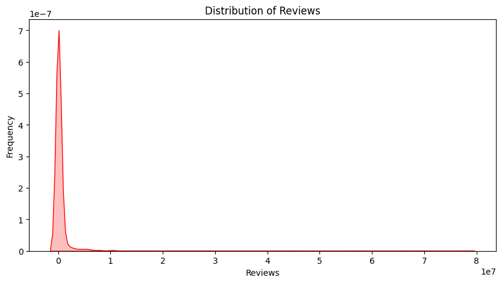

# Social and Information Networks
# Insights from Dataset Analysis

## About the Dataset

- App: Application name
- Category: Category the app belongs to
- Rating: Overall user rating of the app (as when scraped)
- Reviews: Number of user reviews for the app (as when scraped)
- Size: Size of the app (as when scraped)
- Installs: Number of user downloads/installs for the app (as when scraped)
- Type: Paid or Free
- Price: Price of the app (as when scraped)
- Content Rating: Age group the app is targeted at - Children / Mature 21+ / Adult
- Genres: An app can belong to multiple genres (apart from its main category). For eg, a musical family game will belong to Music, Game, Family genres.
- Last Updated: Date when the app was last updated on Play Store (as when scraped)
- Current Ver: Current version of the app available on Play Store (as when scraped)
- Android Ver: Min required Android version (as when scraped)

# Overview

<h3 style="color:#84cae8">
This analysis was conducted on Google Playstore Applications, which contains may features. The purpose of this analysis is to uncover key trends and find useful insights from the data </h3>

# Insights

<h2 style="color:#84cae8"> Insight-1

<iframe width="800" height="500" frameborder="0" scrolling="no" src="https://chart-studio.plotly.com/~amansinganamala/7.embed"></iframe>

<ul>
<li>Most users gave an rating between 4 and 5 with a count of 7049</li>
<li>Average of rating of application in store is around 4 which is very high</li>
</ul>
</h2>

  

<h2 style="color:#84cae8"> Insight-2

<iframe width="1200" height="1200" frameborder="0" scrolling="no" src="https://chart-studio.plotly.com/~amansinganamala/14.embed"></iframe>

<ul>
<li>Game and Family category are the most appearances for application in store</li>
<li>Beauty and Events are the least most appearances for application in store</li>
</ul>
</h2>

  

<h2 style="color:#84cae8"> Insight-3
 
<iframe width="1500" height="500" frameborder="0" scrolling="no" src="https://chart-studio.plotly.com/~amansinganamala/16.embed"></iframe>

<ul>
<li>The ratings of applications in each category are relatively similar. Above 4</li>

</ul>
</h2>

  

<h2 style="color:#84cae8"> Insight-4

  

 

 

<ul>

<li>Get apps with most reviews   i.e. reviews>50000000</li>

</ul>
</h2>

  

<h2 style="color:#84cae8"> Insight-5

<iframe width="500" height="500" frameborder="0" scrolling="no" src="https://chart-studio.plotly.com/~amansinganamala/18.embed"></iframe>

<ul>
<li>Game and Family category are the most appearances for application in store</li>
<li>Beauty and Events are the least most appearances for application in store</li>
</ul>
</h2>

|      | App                                      | Category      |   Rating |   Reviews | Size               | Installs       | Type   |   Price | Content Rating   | Genres        | Last Updated   | Current Ver        | Android Ver        |
|-----:|:-----------------------------------------|:--------------|---------:|----------:|:-------------------|:---------------|:-------|--------:|:-----------------|:--------------|:---------------|:-------------------|:-------------------|
| 2544 | Facebook                                 | SOCIAL        |      4.1 |  78158306 | Varies with device | 1,000,000,000+ | Free   |       0 | Teen             | Social        | August 3, 2018 | Varies with device | Varies with device |
| 3943 | Facebook                                 | SOCIAL        |      4.1 |  78128208 | Varies with device | 1,000,000,000+ | Free   |       0 | Teen             | Social        | August 3, 2018 | Varies with device | Varies with device |
|  336 | WhatsApp Messenger                       | COMMUNICATION |      4.4 |  69119316 | Varies with device | 1,000,000,000+ | Free   |       0 | Everyone         | Communication | August 3, 2018 | Varies with device | Varies with device |
|  381 | WhatsApp Messenger                       | COMMUNICATION |      4.4 |  69119316 | Varies with device | 1,000,000,000+ | Free   |       0 | Everyone         | Communication | August 3, 2018 | Varies with device | Varies with device |
| 3904 | WhatsApp Messenger                       | COMMUNICATION |      4.4 |  69109672 | Varies with device | 1,000,000,000+ | Free   |       0 | Everyone         | Communication | August 3, 2018 | Varies with device | Varies with device |
| 2604 | Instagram                                | SOCIAL        |      4.5 |  66577446 | Varies with device | 1,000,000,000+ | Free   |       0 | Teen             | Social        | July 31, 2018  | Varies with device | Varies with device |
| 2545 | Instagram                                | SOCIAL        |      4.5 |  66577313 | Varies with device | 1,000,000,000+ | Free   |       0 | Teen             | Social        | July 31, 2018  | Varies with device | Varies with device |
| 2611 | Instagram                                | SOCIAL        |      4.5 |  66577313 | Varies with device | 1,000,000,000+ | Free   |       0 | Teen             | Social        | July 31, 2018  | Varies with device | Varies with device |
| 3909 | Instagram                                | SOCIAL        |      4.5 |  66509917 | Varies with device | 1,000,000,000+ | Free   |       0 | Teen             | Social        | July 31, 2018  | Varies with device | Varies with device |
|  382 | Messenger – Text and Video Chat for Free | COMMUNICATION |      4   |  56646578 | Varies with device | 1,000,000,000+ | Free   |       0 | Everyone         | Communication | August 1, 2018 | Varies with device | Varies with device |
|  335 | Messenger – Text and Video Chat for Free | COMMUNICATION |      4   |  56642847 | Varies with device | 1,000,000,000+ | Free   |       0 | Everyone         | Communication | August 1, 2018 | Varies with device | Varies with device |
| 4104 | Messenger – Text and Video Chat for Free | COMMUNICATION |      4   |  56642847 | Varies with device | 1,000,000,000+ | Free   |       0 | Everyone         | Communication | August 1, 2018 | Varies with device | Varies with device |

  

<h2 style="color:#84cae8"> Insight-6

<iframe width="1000" height="800" frameborder="0" scrolling="no" src="https://chart-studio.plotly.com/~amansinganamala/20.embed"></iframe>

<ul>
<li>Seem like well-known application will get a good rating</li>

</ul>
</h2>

  

<h2 style="color:#84cae8"> Insight-7 </h2>

<ul>
<li>Seem like number of install affect to rating.  Applications with more installs have more ratings </li>

</ul>

